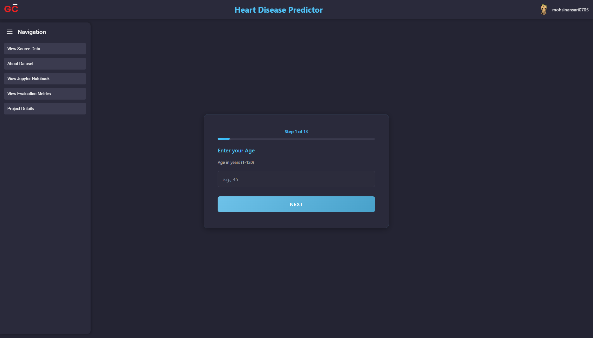

# Heart Disease Predictor

A comprehensive machine learning web application that predicts the likelihood of heart disease based on user-provided health metrics. Built with HTML, CSS, JavaScript, and powered by a trained logistic regression model.

[Use Heart-Disease Predictor here 👆](https://graycode-heartdisease-predictor.vercel.app/)



## Features

- **Interactive Step-by-Step Form**: 13-step guided input collection with real-time validation
- **Machine Learning Prediction**: Trained logistic regression model with 88.52% accuracy
- **Real-time Risk Assessment**: Instant prediction with confidence scores
- **Comprehensive Documentation**: Complete project information and data insights
- **Responsive Design**: Optimized for desktop, tablet, and mobile devices
- **Dark Theme UI**: Professional dark interface optimized for readability
- **Professional Animations**: Smooth transitions and loading indicators

## Tech Stack

- **Frontend**: HTML, CSS, JavaScript
- **Machine Learning**: Python, Scikit-learn, Pandas, NumPy
- **Data Analysis**: Jupyter Notebooks, Matplotlib, Seaborn
- **Dataset**: Cleveland Heart Disease Dataset (UCI ML Repository)

## Sidebar Navigation

The application includes many information buttons:

### 📊 **View Source Data**
- Complete dataset preview with sample records
- Data structure and target variable information
- Statistical overview of 303 patient records
- Direct download link to the CSV dataset

### 📋 **About Dataset**
- Detailed feature descriptions for all 13 medical attributes
- Value ranges and coding explanations
- Data source and collection methodology
- Feature importance and medical significance

### 📓 **View Jupyter Notebook**
- Complete end-to-end machine learning analysis
- Interactive notebook viewer (nbviewer integration)
- Direct GitHub repository link

### 📈 **View Evaluation Metrics**
- Model performance metrics (Accuracy: 88.52%)
- Cross-validation results and consistency scores
- Confusion matrix and classification report
- Feature importance rankings

### 🔍 **Project Details**
- Technical stack and project architecture
- Development process and methodology
- Project structure and file organization
- Developer information and GitHub links

## Getting Started

1. **Clone the repository:**
   ```bash
   git clone https://github.com/mohsinansari0705/Heart-Disease-predictor.git
   cd Heart-Disease-predictor
   ```

2. **Navigate to the src directory:**
   ```bash
   cd src
   ```

3. **Open the application:**
   - Open `index.html` in your web browser
   - Or use a local server for best experience:
   ```bash
   # Using Python
   python -m http.server 8000
   ```

4. **Access the application:**
   - Open [http://localhost:8000](http://localhost:8000) in your browser

## Project Structure

```
Heart-Disease-predictor/
├── api/                           # Serverless function folder
│   ├── predict.py                 # Serverless function
│   └── model/                     # Model folder
│       └── log_reg_model.pkl      # Trained model
├── src/                           # Frontend application
│   ├── index.html                 # Main web interface
│   ├── style.css                  # Core styling and responsive design
│   ├── sidebar_style.css          # Sidebar and modal styling
│   ├── script.js                  # Main application logic
│   ├── modal_script.js            # Modal functionality and content
│   ├── predictionService.js       # Predict Heart Disease
│   ├── requirements.txt           # Project dependencies
│   └── images/                    # Project assets
│       ├── gc_logo.png            # Application logo
│       ├── groot_profile.png      # Developer profile image
│       └── project_UI.png         # Project screenshot
├── heart disease classification/  # Machine Learning components
│   ├── *.ipynb                    # Jupyter notebooks
│   └── data/                      # Dataset files
├── README.md                      # Project documentation
├── requirements.txt               # Python dependencies
└── vercel.json                    # Vercel configuration
```

## Dataset Information

The application uses the **Cleveland Heart Disease Dataset** from the UCI Machine Learning Repository:

- **Total Samples**: 303 patients
- **Features**: 13 medical attributes
- **Target**: Binary classification (0 = no disease, 1 = disease present)
- **Class Distribution**: Balanced dataset (approximately 54.45-45.54 split)
- **Data Quality**: No missing values, preprocessed and validated

### Key Features Used:
1. Age, Sex, Chest Pain Type
2. Resting Blood Pressure, Cholesterol Level
3. Fasting Blood Sugar, Resting ECG Results
4. Maximum Heart Rate, Exercise Induced Angina
5. ST Depression, Slope, Major Vessels, Thalassemia

## Model Performance

- **Algorithm**: Logistic Regression with L2 regularization
- **Accuracy**: 88.52%
- **Precision**: 82.15%
- **Recall**: 92.72%
- **F1-Score**: 87.05%
- **Cross-Validation**: 84.79% ± 3.7%

## Usage Instructions

1. **Start Prediction**: Click through the 13-step form
2. **Enter Health Metrics**: Provide accurate medical information
3. **Receive Results**: Get instant risk assessment with confidence score
4. **Explore Data**: Use sidebar buttons to learn about the dataset and methodology
5. **Review Documentation**: Access complete Jupyter notebook analysis

## Important Disclaimer

⚠️ **Medical Disclaimer**: This application is designed for educational and research purposes only. The predictions generated should never replace professional medical consultation, diagnosis, or treatment. Always consult with qualified healthcare providers for accurate medical advice and proper health assessments.

## Contributing

1. Fork the repository
2. Create your feature branch (`git checkout -b feature/AmazingFeature`)
3. Commit your changes (`git commit -m 'Add some AmazingFeature'`)
4. Push to the branch (`git push origin feature/AmazingFeature`)
5. Open a Pull Request

## License

This project is licensed under the MIT License - see the [LICENSE](LICENSE) file for details.

## Developer

**Mohsin Ansari** - Machine Learning & Agentic AI Specialist  
[](https://github.com/mohsinansari0705/)  
[](https://github.com/mohsinansari0705/Heart-Disease-predictor)

## Acknowledgments

- UCI Machine Learning Repository for the Cleveland Heart Disease Dataset
- Kaggle community for data preprocessing and insights
- Medical professionals who contributed to the original data collection
- Open source community for tools and libraries used in this project

### ⭐ If you found this project helpful, please consider giving it a star!